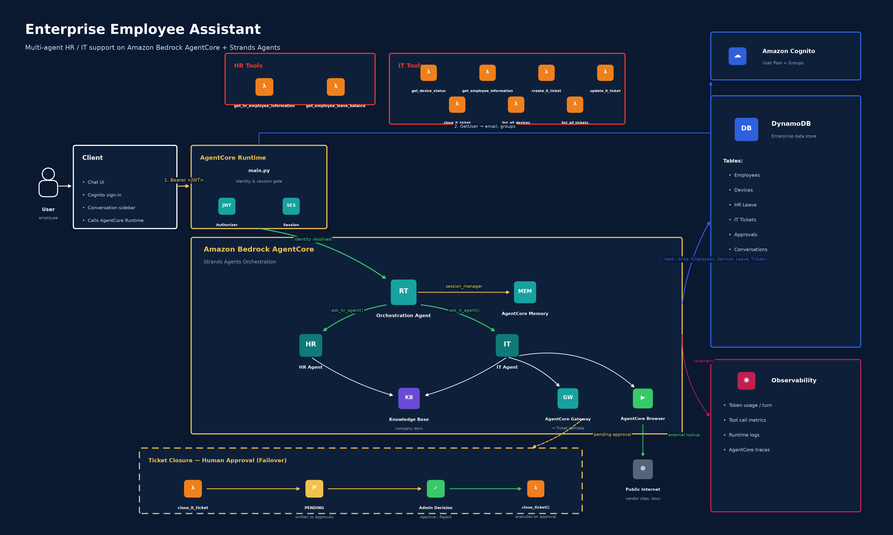

# Enterprise Employee Assistant

A multi-agent HR/IT support assistant built with the [Strands Agents SDK](https://github.com/strands-agents/sdk-python)
and deployed on [Amazon Bedrock AgentCore](https://aws.amazon.com/bedrock/agentcore/). A single **Orchestration
Agent** authenticates every request against Amazon Cognito, then delegates to a domain specialist — **HR Agent** or
**IT Agent** — that calls enterprise DynamoDB tools, a shared Bedrock Knowledge Base, a gateway-fronted ticketing
Lambda, or a live browser session, all under the identity resolved once at the entrypoint.



## How a request is handled

1. **`main.py`** (`@app.entrypoint`) receives the invocation. The AgentCore Runtime's `CUSTOM_JWT` authorizer has
   already validated the Cognito-issued bearer token at the platform boundary; `main.py` additionally requires an
   `Authorization: Bearer <token>` header to be present and non-empty.
2. **`services/auth_service.py`** calls Cognito `GetUser` with the access token to resolve the caller's email,
   username, and `cognito:groups`. Membership in the `ITAdmin` group maps to role `ITAdmin` (no employee record
   required); everyone else is resolved to an `EnterpriseEmployees` record by email and treated as `Employee`.
3. **`services/conversation_service.py`** creates or resumes conversation metadata (title, timestamps) in DynamoDB,
   keyed by `actor_id` + `session_id`.
4. **`agents/orchestration_agent.py`** is created fresh per request with the resolved `actor_id` and `user_role`
   baked into its system prompt (never taken from the user's message text). It exposes exactly two tools —
   `ask_hr_agent` and `ask_it_agent` — and routes the request to whichever domain(s) it concerns.
5. The **domain agent** (HR or IT) calls its own enterprise tools, the shared Knowledge Base, the IT Gateway/MCP
   client, or AgentCore Browser, and returns plain response text back up to the orchestrator.
6. **`main.py`** streams the underlying model events back to the caller, accumulates token/tool-usage metrics, and
   emits a final `observability` + `conversation` payload once the stream completes.

Identity is treated as a single source of truth throughout: the Requester ID and role are resolved once from the
Cognito token, threaded through every system prompt and tool call, and every backend tool re-checks authorization
independently — the LLM is never the authorization boundary.

## Components

| Layer | File | Responsibility |
| --- | --- | --- |
| Entrypoint | `main.py` | Validates the bearer header, resolves/creates the session, extracts the prompt (plain string, message history, or tool results), streams the response, reports usage. |
| Auth | `services/auth_service.py` | Resolves a Cognito access token to `AuthenticatedUser` (email, username, employee_id, groups). |
| Orchestration | `agents/orchestration_agent.py` | Central router; binds identity once, delegates to `ask_hr_agent` / `ask_it_agent`, never touches enterprise tools directly. |
| HR domain | `agents/hr_agent.py`, `tools/hr_tools.py` | Employee info, leave balance, holidays, benefits. |
| IT domain | `agents/it_agent.py`, `tools/it_tools.py` | Device status, IT tickets (create/update/close/list), IT policy, and external/public web lookups via AgentCore Browser. |
| Knowledge | `tools/knowledge_tools.py`, `services/knowledge_service.py` | `search_company_knowledge`, backed by a Bedrock Knowledge Base retrieval call; shared by both domain agents. |
| Gateway/MCP | `mcp_client/gateway_client.py` | Streamable-HTTP MCP client carrying the caller's bearer token to `EnterpriseAssistantGateway`, which fronts `ITTicketLambda` for ticket-detail lookups. |
| Memory | `memory/session.py` | Wires the Strands session manager to AgentCore Memory namespaces (`facts`, `preferences`, `episodes`, `summaries`) per actor/session. |
| Conversations | `services/conversation_service.py` | Sidebar conversation metadata (title, created/updated timestamps) in DynamoDB. |
| Approvals (HITL) | `services/approval_service.py` | Human-in-the-loop store for sensitive actions (e.g. ticket closure): writes a `PENDING` record and only executes the backend write once a human approves or rejects it. |
| Model | `model/load.py` | Amazon Nova 2 Lite via `BedrockModel`, with a Bedrock Guardrail attached for content filtering and prompt-attack detection. |

## Data stores

| Table / Resource | Used by | Purpose |
| --- | --- | --- |
| `EnterpriseEmployees` (DynamoDB) | HR + IT agents, auth | Employee profile lookup by ID or email. |
| `EnterpriseDevices` (DynamoDB) | IT agent | Device/laptop status, per-employee or org-wide (`ITAdmin`). |
| `EnterpriseHRLeave` (DynamoDB) | HR agent | Leave balance per employee. |
| `EnterpriseITTickets` (DynamoDB) | IT agent, Gateway/Lambda | Ticket create/update/close/list. |
| `EnterpriseAssistantApprovals` (DynamoDB) | Approval service | HITL approvals for sensitive actions. |
| `EnterpriseAssistantConversations` (DynamoDB) | Conversation service | Session/conversation metadata. |
| Bedrock Knowledge Base | Both agents | Company policies, procedures, and other internal documentation. |
| AgentCore Memory | Orchestration agent | Cross-turn semantic facts, preferences, episodic history, and summaries. |
| AgentCore Gateway (MCP) → Lambda | IT agent | External tool target for ticket-detail retrieval, authorized per-caller via the same JWT. |
| AgentCore Browser | IT agent | Live browsing of external/public sites (vendor docs, status pages, driver downloads) — never used to access enterprise data. |

## Human-in-the-loop: closing a ticket

`close_it_ticket` does not close a ticket directly. It creates a `PENDING` record via
`services/approval_service.create_approval`; the IT Agent reports this to the user as "approval required," and the
ticket is only actually closed once a human calls `resolve_approval` with an `APPROVED` decision, which then invokes
`services/ticket_service.close_ticket`. The agents are explicitly instructed to never claim a ticket is closed until
the backend confirms it.

## Environment variables

| Variable | Required | Description |
| --- | --- | --- |
| `AWS_REGION` | Yes | Region for DynamoDB, Cognito, Bedrock, and Gateway clients (deployed as `ap-south-1`). |
| `MEMORY_ENTERPRISEASSISTANTMEMORY_ID` | No | AgentCore Memory resource ID; when unset, memory-backed session management is skipped. |
| `CONVERSATIONS_TABLE_NAME` | No | Overrides the default `EnterpriseAssistantConversations` table name. |

## Developing locally

A virtual environment is created automatically by the AgentCore CLI with dependencies from `pyproject.toml`
installed. Activate it, then run the agent locally:

```bash
source .venv/bin/activate        # macOS/Linux
agentcore dev                    # starts a local server on 0.0.0.0:8080
```

In a separate terminal:

```bash
agentcore invoke --dev "What is my leave balance?"
```

Local runs still require a valid Cognito bearer token and reach real AWS resources (DynamoDB, Cognito, Bedrock,
Gateway) — there are no mocked backends.

## Testing

```bash
pytest
```

Tests live under `test/` and cover the HR/IT agents, HR/IT tool authorization logic, the MCP client, the
orchestration agent's routing, and the service layer.

## Deployment

Deployment is declarative via the AgentCore CLI project at `agentcore/agentcore.json`:

- **Runtime:** `EnterpriseAssistant`, `CodeZip` build, `PYTHON_3_14`, `PUBLIC` network mode, `HTTP` protocol, behind a
  `CUSTOM_JWT` authorizer pointed at the same Cognito user pool used for authentication.
- **Memory:** `EnterpriseAssistantMemory` with `SEMANTIC`, `USER_PREFERENCE`, `SUMMARIZATION`, and `EPISODIC`
  strategies, 30-day event expiry.
- **Gateway:** `EnterpriseAssistantGateway` (MCP), fronting `ITTicketLambda` via a `lambdaFunctionArn` target,
  authorized with the same `CUSTOM_JWT` configuration.

```bash
agentcore deploy      # synthesizes CDK (agentcore/cdk/) and deploys to AWS
agentcore status       # check deployment status
agentcore invoke       # invoke the deployed agent
agentcore logs         # stream runtime logs
```

See [`AGENTS.md`](../../AGENTS.md) at the project root for the full CLI reference and schema documentation.
